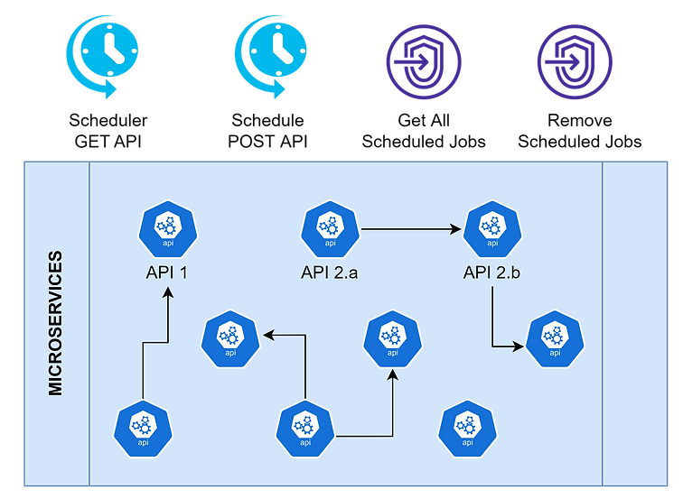

# spring-boot-scheduler

Objective is to create a Spring Scheduler with dynamically scheduling jobs

It provides rest api's to schedule certain jobs/tasks using this Spring Scheduler, which will allow other projects
to use this service inside their microservices without any change/addition to the existing microservices. 



e.g. cron with every 10 seconds

```java

@Scheduled(cron = "0/10 * * * * *", zone = "Asia/Kolkata")
public void task() {
    System.out.println("Every 10 seconds");
}
```

e.g. fixed delay of 10 seconds

```java

@Scheduled(fixedDelay = 10000)
public void task() {
    System.out.println("Every 10 seconds");
}
```

e.g. fixed rate of 10 seconds

```java

@Scheduled(fixedRate = 10000)
public void task() {
    System.out.println("Every 10 seconds");
}
```

Or you can use the parameterized string, which will take value from *.properties or * yml file.

```java

@Scheduled(fixedDelayString = "${fixedDelay.in.millisec}")
public void task() {
    System.out.println("Every 10 seconds");
}
```

The project will have following REST endpoints:

```shell

Schedule GET API's:
Type: POST
endpoint: /scheduleGet
payload: Job
description: It will allow user to schedule the Rest API's of GET type.

Schedule POST API's:
Type: POST
endpoint: /schedulePost
payload: Job
description: It will allow user to schedule the Rest API's of POST type.

Get all scheduled Jobs:
Type: GET
endpoint: /scheduledJobs
description: It will allow user to see all the scheduled jobs in this application.

Delete any scheduled Jobs:
Type: DELETE
endpoint: /deleteJob/{jobId}
description: It will allow user to delete any scheduled job running in this application.
```

### Things todo list

1. Clone this repository: `git clone https://github.com/hendisantika/spring-boot-scheduler.git`
2. Navigate to the folder: `cd spring-boot-scheduler`
3. Run the application: `mvn clean spring-boot:run`
4. Open your Postman App
5. Import Postman Collection 

```shell
curl --location 'http://localhost:8080/scheduleIt' \
--header 'Content-Type: application/json' \
--data '{
    "jobName": "test-get3",
    "apiURL": "/hello",
    "baseURL": "http://localhost:8080",
    "cron": "10 * * * * *"
}'
```

```shell
curl --location 'http://localhost:8080/schedulePost' \
--header 'Content-Type: application/json' \
--data '{
    "jobName": "test-get",
    "apiURL": "/hello",
    "baseURL": "http://localhost:8080",
    "cron": "10 * * * * *"
}'
```

```shell
curl --location --request GET 'http://localhost:8080/scheduledJobs' \
--header 'Content-Type: application/json' \
--data '{
    "jobName": "test-get",
    "apiURL": "/hello",
    "baseURL": "http://localhost:8080",
    "cron": "10 * * * * *"
}'
```

```shell
curl --location --request DELETE 'http://localhost:8080/deleteJob/test-get3' \
--header 'Content-Type: application/json' \
--data '{
    "jobName": "test-get",
    "apiURL": "/hello",
    "baseURL": "http://localhost:8080",
    "cron": "10 * * * * *"
}'
```

```shell
curl --location 'http://localhost:8080/hello'
```
